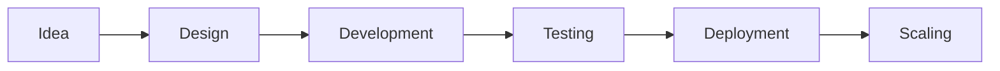

<div align="center">


# 👋 Hey, I'm Vivek Lanke

### 🚀 Full-Stack Developer | AI Enthusiast | Building Smart Products

<p align="center">


</p>

<p align="center">


</p>

</div>

---

# ⚡ About Me

```yaml
Name: Vivek Lanke
Role: Full-Stack Developer
Specialization: Web + AI Systems
Current Focus: Scalable Products
Learning: System Design + AI Automation
```

✨ Building production-ready applications  
🤖 Exploring AI systems and automation  
⚡ Creating scalable and optimized solutions  
📚 Practicing DSA and backend architecture  
🚀 Shipping projects consistently  

---

# 🚀 Featured Projects

<div align="center">

| Project | Description | Tech Stack |
|---------|-------------|------------|
| 💬 Chattify | Real-time chat application with authentication | Next.js, Socket.io, MongoDB |
| 🤖 ClusterAI | AI tools platform for smart text generation | Next.js, MongoDB, Ollama |
| 📚 BookSync | Digital book inventory manager | React, Tailwind, MockAPI |
| 🔄 ConvertFree | Unlimited file conversion platform | Next.js, TypeScript |
| 🧠 AI Attendance System | Face recognition based smart attendance tracking | MERN, Python, Flask, OpenCV, Haar Cascade |

</div>

---

# 💻 Tech Stack

<div align="center">


</div>

---

# 🧠 Core Expertise

<div align="center">

| Domain | Skills |
|--------|--------|
| Frontend | React, Next.js, TailwindCSS |
| Backend | Node.js, Express, Flask |
| Database | MongoDB |
| AI/ML | OpenCV, TensorFlow, Deep Learning |
| LLM Engineering | Ollama, AI Integrations |
| Computer Vision | Face Recognition, Haar Cascade |
| Programming | JavaScript, TypeScript, Python, C++ |
| Deployment | Vercel, GitHub |

</div>

---

# ⚙ Development Workflow

<div align="center">



</div>

---

# 📊 GitHub Analytics

<div align="center">


</div>

---

# 🔥 Contribution Streak

<div align="center">


</div>

---

# 📈 Contribution Graph

<div align="center">


</div>

---

# 📊 Profile Summary

<div align="center">


</div>

---

# 🚀 Currently Building

<div align="center">

🔹 AI-Powered Automation Systems  
🔹 Face Recognition Attendance Platforms  
🔹 LLM-Based Smart Applications (Ollama)  
🔹 Deep Learning Projects  
🔹 Full Stack SaaS Products  
🔹 Computer Vision Solutions  

</div>

---

# 💡 Developer Philosophy

<div align="center">

> **Build. Ship. Improve. Repeat.**

</div>

---

# 🌐 Connect With Me

<div align="center">

<a href="https://www.linkedin.com/in/vivek-lanke-87a1a628a">

</a>

<a href="mailto:viveklanke100@gmail.com">

</a>

<a href="https://github.com/viveklanke007">

</a>

</div>

---

<div align="center">


### ⚡ Code • Create • Scale • Innovate

⭐ Follow my journey as I build impactful software.

</div>
